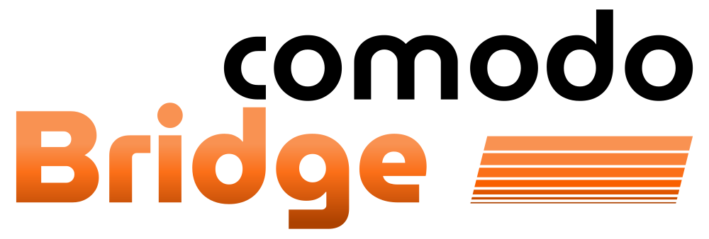

  

# COMODO Bridge

Módulo del proyecto COMODO, que convierte al PLC en un puente de comunicación. Actúa como intermediario entre el robot industrial y el gemelo digital en Unreal Engine.

Incluye una librería de funciones para **Sysmac Studio** que simplifica el parseo de tramas de datos (Ethernet/IP) y la configuración del PLC para exponer las variables a un servidor OPC UA.

##  Estructura del Proyecto

- **`/Source`**: Contiene el código fuente en Structured Text (ST) de las funciones y bloques de función
- **`/Sysmac_Project`**: Archivos del proyecto de Sysmac Studio (configuración y Ladder), y la librería exportada.

##  Instalación

1.  Clona este repositorio.
2.  Abre el proyecto de Sysmac Studio, o un proyecto existente.
3.  Importa la librería en tu proyecto.
4.  Configura las variables del servidor OPC UA según el archivo de ejemplo proporcionado.

> **Nota**: Este proyecto ha sido desarrollado y probado con un PLC **Omron NX102-9020 v1.50**.
